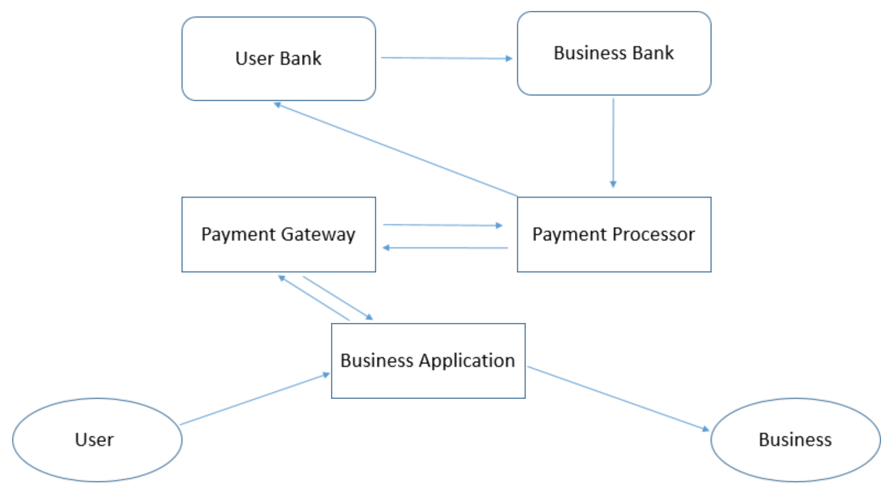
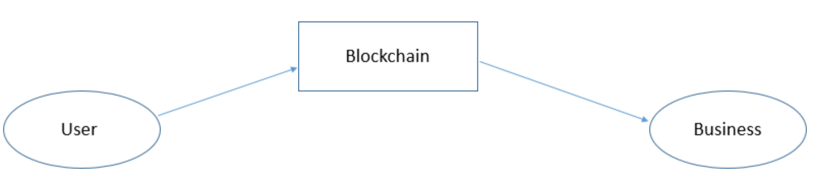

# Opoch Payments

Cryptocurrencies are transactional systems~~, where the value of the currency should derive from volume of the transactions and velocity. Yet the number of transactions occurring are very limited. On the other hand,~~ Today, it is difficult for businesses and services to take payments in cryptocurrency, creating rise for speculation and delayed adoption.

~~To enable businesses to take cryptocurrency payments with ease completes the user journey with Opoch. We create APIs which helps businesses create smart-contract with help of which makes the taking cryptocurrency payments easier for businesses.~~

Since each business has a unique payment scheme specific to their product or service, it is not feasible to provide them with just an address to accept all payments. They might have subscriptions or might want to store some meta-data with the transaction which isn't possible with just a wallet. So we propose to provide them with a solution where they can interact with blockchain via smart contracts, deployed by Opoch on their behalf. 

These cater to Business use cases and abstracts the underlying logic and complexity of blockchain, just like in the case of centralised payment solutions.

For this they can hit an Opoch API with parameters describing their payment scheme\(s\), which would deploy a contract for their use case. This contract in turn would be used to process their payments, just like in the centralised world. Developers can charge the user in any cryptocurrency, Opoch DEX would internally handle the conversions for the user without him/her having to jump through hoops to change the currency.

For the e-commerce use case we would also provide the developers a SDK wherein they can request payments from a user browsing their website and the user can then verify/approve the payment from their Opoch wallet app. 

* ~~and hierarchical deterministic~~

~~With Opoch we take the current payment ecosystem shown in figure 1 to the one shown in figure 2 using smart contracts. Which enable us to achieve:~~

* ~~No-counter party risk~~
* ~~Reduced Fees~~
* ~~Immutability~~
* ~~Security~~

The existing digital payment ecosystem involves interaction of parties involved via multiple intermediaries like different banks, payment processors with the added overhead to manage currency conversions, security and keeping record of all the payments. As shown in the figure:

With Opoch we remove all these intermediaries with blockchain, making the payments:

* Easier 
* Faster
* Secure
* With lower fees
* Immutable 
* Without third party dependency or risk

The proposed architecture:

