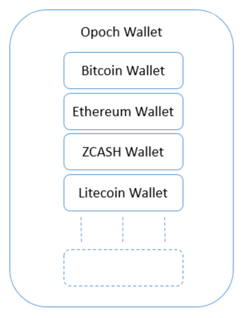

# Wallet

### Key Features

1. Multi-Currency
2. Cross-Platform
3. Social Recovery

### Multi-Currency

Opoch wallet is a multi-currency wallet, i.e. it can be used with Bitcoin, Ethereum, Litecoin, ZCash and all other cryptocurrencies with ease.

Opoch wallet uses a single master-seed phrase that generates cryptographically secure Private-Public Key pairs in required formats with adequate randomness for different blockchains. This allows users to hold multiple cryptocurrencies conveniently without the hassles of remembering multiple mnemonics.

_Opoch Wallet encapsulating several Cryptocurrency wallets_

### Cross-Platform

Opoch features a cross-platform wallet, i.e. if a user would like to switch from one platform to another, such as Mobile to desktop, or Android to iOS, Opoch allows users to make this switch conveniently via either Importing Master-Seed Phrase or pairing via Opoch Mobile App \(Similar to Web Whatsapp\) 

### Social Recovery

Social recovery is the concept by which a user is able to recover lost private keys securely with the help of his/her personal network. Unlike the current centralized systems used in banking there is no mechanism to re-access the funds in-case private keys are lost.

Opoch uses **Shamir's Secret Sharing** algorithm for building Social Recovery mechanisms for recovery of lost private keys \[29\]. Users have the option to securely split the private key in `n` parts, recoverable with the help of `k` parts among them. Thus, providing users a complete freedom over balancing between security and convenience.

