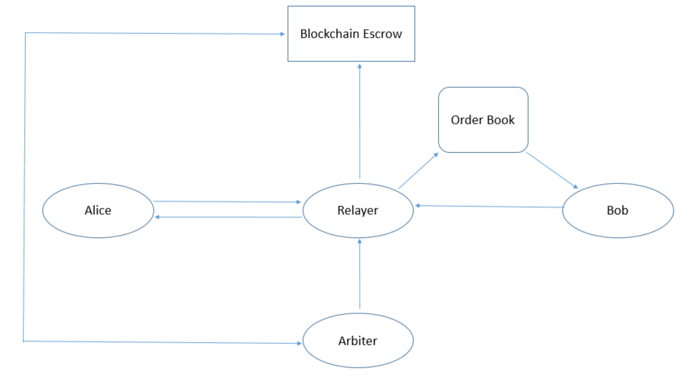

# Fiat-Crypto P2P Marketplace

This is the first service we're building in Opoch. As discussed earlier, Opoch aims to make exchange of cryptocurrencies truly decentralized and peer-to-peer, thus fulfilling the original Satoshi vision.

We create smart-contract powered escrows to enable trades without any third party holding the crypto funds in transaction. Buyers or sellers can create bids off-chain and transactions are completed on-chain using these escrows. This off-chain and on-chain interaction provides much necessary transaction finality in user’s fund, while reducing the latency and cost involved in the trade.

To initiate the mass adoption for cryptocurrency, it is important that on-boarding of new users is seamless. Thus, creating this Fiat-Crypto Peer-to-Peer marketplace opens up transaction channels \(eg. PayTm, M-Pesa, Alipay, Cash\) which are otherwise not possible. This also opens up possibilities in limited banking channel penetration.

There are four participants in this function and roles of these are briefly described below:

1. **Buyer and Seller**: They can create new bids at their preferred price or buy/sell from already listed orders to do almost instant trade.
2. **Relayer:** Opoch will act as the first relayer till the community matures. Relayer’s task is to enable smooth matching of the bids with the buyers or sellers. We have built the platform where users can do transactions by just using the escrows without going through relayer, but relayer provides the ease of access required. 
   * Another benefit of having a relayer is that relayer can provide the transaction cost necessary to complete the on-chain transaction as new user being on-boarded might not be able to pay the cost for transaction.
3. **Arbiter:** In case of the dispute arbiter comes in to resolve the dispute. Token holders can become arbiter by staking some of their tokens in return of part of commission. 

1. Alice creates an off-chain bid on relayer to buy OPOCH Tokens.
2. Relayer broadcasts the bid on it's platform and updates it's order book.
3. Bob finds Alice's bid on Relayer's platform and requests to full-fill the bid.
4. Relayer connects Alice and Bob so that they can finalise the terms.
5. Bob signs a **message** with his private key and relays it to the Relayer to be sent to blockchain, after finalising terms with Alice.
6. Relayer verifies the message and sends transaction to blockchain and escrow is created.
7. Alice is notified and proceeds to transfer fiat to Bob by the method mutually decided.
8. Bob receives payment and releases the escrow, Arbiter and Relayer get their fees and Alice receives the token.

The message signed by Bob includes the amount of tokens requested by Alice and:

| Name | Type | Description |
| --- | --- | --- | --- | --- | --- | --- | --- | --- | --- | --- |
| seller\_address | address | Address of Seller |
| buyer\_address | address | Address of Buyer |
| arbiter\_address | address | Address of Arbiter |
| arbiter\_fees | uint256  | Fees to Arbiter |
| relayer\_address | address | Address of Relayer |
| relayer\_fees | uint256 | Fees to Relayer |
| token\_amount | uint256 | Amount of token in escrow |
| fiat\_amount | uint256 | Amount of fiat to be paid |
| expiration | uint256 | Expiration time of escrow |
| v, r, s | uint8, bytes32, bytes32 | ECDSA Signature of above parameters. |

As a side note, we believe the technology and community used to enable fiat-to-crypto transactions in a peer-to-peer manner, will also be used to enable new markets that can replace fiat currencies for services and products. 

where users would be exchanging crypto assets/tokens with services and products as the technology is already in place, the best use case for exchange right now being fiat.

