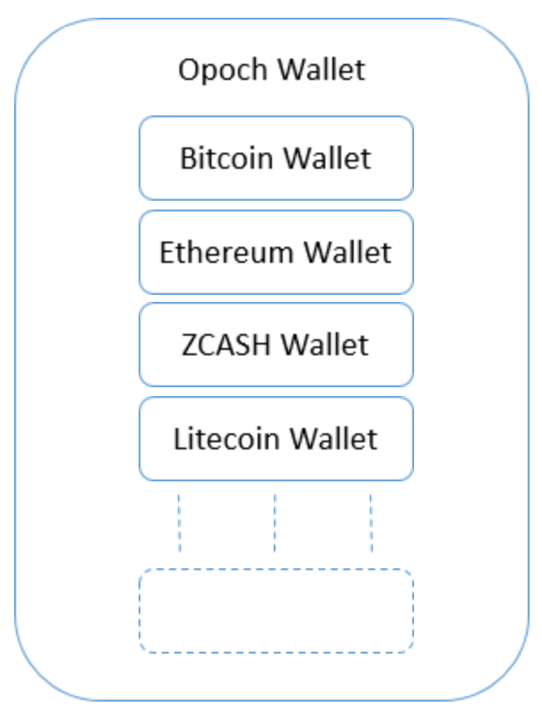

# Universal Mobile Wallet

### Key Features

#### Universality

#### Social Recovery

One of the reason users prefer to use centralized wallets over their decentralized counterparts is concern over difficulty to remember the mnemonic seed or private keys for a long period of time in case of losing the device. Unlike the current centralized systems used in banking there is no recovery mechanism to re-access the funds if private keys or mnemonic seed is lost.

We enable social recovery mechanism for private keys enabling users to restore the private keys. The users have options to share the signed transaction with few friends enabling recovery of private keys. We are using **Shamir's Secret Sharing** algorithm for our research right now and closely looking at upcoming research in field.

We are working to devise the exact mechanism to be able to regather private keys even if one of the friends has also lost access to the signed transaction.

Apart from this we are exploring the DDKG Algorithm created by Device Authority where they generate private keys specific to a device, which could prove to be useful in case of loss of data on the device.

~~-----~~

~~From an adoption point of view for the masses, the biggest challenges wallets face are ease-of-use, support for multiple crypto currencies/assets, recovery of wallet/keys in case of theft or data loss.~~

~~Since we have built a mobile first application where people can buy or sell and hold their crypto assets and there would be people or businesses who would build mobile applications that would need interaction with user's wallet and crypto assets for payments.~~

