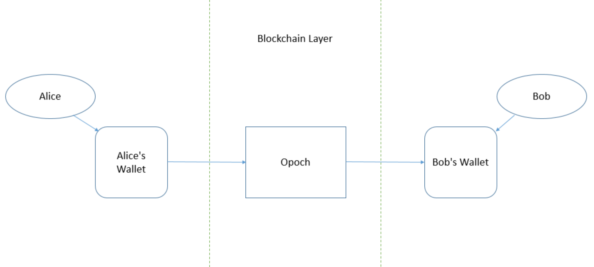

# Opoch Mobile App

In this section we describe in detail the **Opoch Mobile app** and it's sub-modules. 

We discuss the 4 key components of app in detail:

1. Fiat-Crypto P2P Marketplace
2. Decentralized Exchange
3. Universal mobile Wallet
4. Opoch Platform

