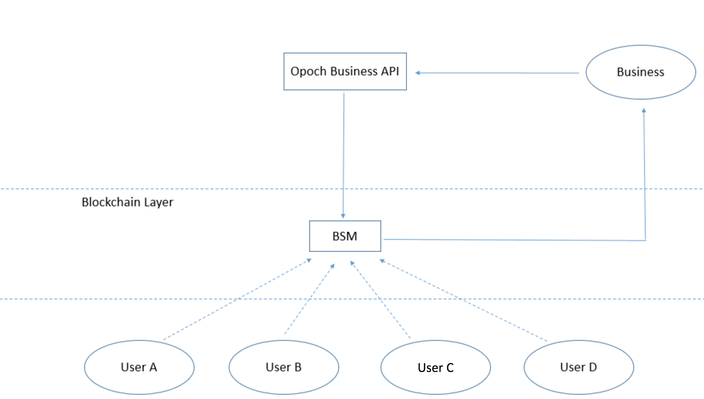
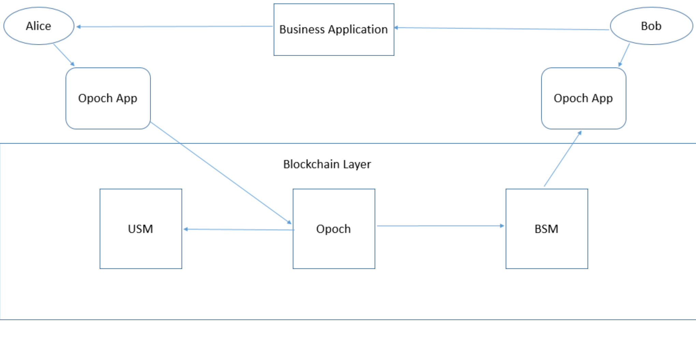

# Example

Below we describe two common payment scenarios:

### Business Specific

1. Bob is a developer with no knowledge of blockchain technology, but is adept in current decentralized payment solutions and is developing an application in which he wants to  accept payments in tokens/crypto-currencies.
2. Bob has a very specific payment scheme in mind, which involves, different subscription models which are valid for different durations and have different amounts.
3. Bob calls the OPOCH business API with appropriate parameters that explain his payment scheme, a contract is deployed for Bob based on these parameters.
4. When user Alice uses Bob's services she deposits her payment to Bob's contract using the OPOCH\_STACK. Copy of meta\_data of the payment is stored in a centralised solution or IPFS which Bob can use for querying or analytics.
5. Bob verifies the payment using the API/SDK provided by OPOCH and based on which kind subscription Alice chose Bob enables the service just like in the centralized world.

### E-commerce

1. Alice is browsing Bob's business application. She likes a product and decides to purchase it.
2. Alice clicks on Payment button and is prompted on her Opoch application for approval of payment.
3. Alice approves payment and her payment request passes through Opoch for conversion to the specified token, using Opoch DEX, or she purchases the tokens using fiat-to-crypto, required by Bob.
4. After conversion Bob is paid the token in his BSM and Alice's USM is updated with the payment done.
5. Bob can now withdraw the amount to his wallet from the contract when he wishes.

