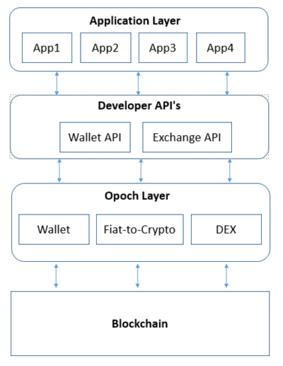

# Opoch

With the described problems in mind, we are building **Opoch App** which we envision will help onboard the next billion cryptocurrency users and become the go-to application for them to interact with the decentralised technology.

In the next section we describe in detail the Opoch App and it's sub-modules.

1. Wallet
2. Decentralized Fiat-Crypto P2P Marketplace
3. Decentralized Crypto Exchange
4. Opoch Platform

## Wallet

### Key Features

1. Multi-Currency
2. Cross-Platform
3. Social Recovery

### Multi-Currency

Opoch wallet is a multi-currency wallet, i.e. it can be used with Bitcoin, Ethereum, Litecoin, ZCash and all other cryptocurrencies with ease.

Opoch wallet uses a single master-seed phrase that generates cryptographically secure Private-Public Key pairs in required formats with adequate randomness for different blockchains. This allows users to hold multiple cryptocurrencies conveniently without the hassles of remembering multiple mnemonics.


_Opoch Wallet encapsulating several Cryptocurrency wallets_

### Cross-Platform

Opoch features a cross-platform wallet, i.e. if a user would like to switch from one platform to another, such as Mobile to desktop, or Android to iOS, Opoch allows users to make this switch conveniently via either Importing Master-Seed Phrase or pairing via Opoch Mobile App \(Similar to Web Whatsapp\)


### Social Recovery

Social recovery is the concept by which a user is able to recover lost private keys securely with the help of his/her personal network. Unlike the current centralized systems used in banking there is no mechanism to re-access the funds in-case private keys are lost.

Opoch uses **Shamir's Secret Sharing** algorithm for building Social Recovery mechanisms for recovery of lost private keys \[29\]. Users have the option to securely split the private key in `n` parts, recoverable with the help of `k` parts among them. Thus, providing users a complete freedom over balancing between security and convenience.


## Decentralized Fiat-Crypto P2P Marketplace

Opoch makes acquiring cryptocurrencies a truly peer-to-peer transaction without any 3rd party holding users' assets. For a great user experience, Opoch aims to achieve this exchange in under a minute, utilizing current and upcoming technologies.

The transaction cycle can be divided into 3 parts:  
1. Search and Discovery  
2. Crypto asset transfer  
3. Fiat-transfer

To reduce the overall latency and cost of completion of a transaction we combine off-chain and on-chain mechanism.

The **search and discovery** aspect of trade is completed off-chain. The user creates orders with their desired price and relevant order details. The counter-party can then search between multiple orders and select the most relevant among them. Being mobile first allows Opoch to utilise notification systems, user live status, location services, etc. in order to innovate freely and enable near-instant matching of counter-parties.

Once the order is matched, **crypto-asset transfer** is completed on chain. We enable these transfers with smart contract escrows for smart contract enabled blockchain assets, and with multi-sig transactions for Bitcoin and similar blockchains.

The **fiat currency transaction** is done peer-to-peer while the crypto-assets are held in escrows. The peer-to-peer transactions allows users to trade cryptocurrencies with fiat currency via any payment channel prevalent in that geography. For eg. _M-pesa in Kenya, Alipay in China, PayTm in India_ and Cash in all geographies.

There are four participants in this exchange and roles of these are briefly described below:

1. **Buyer:** Creates new order or interacts with an existing order.
2. **Seller**: Creates new order or interacts with an existing order.
3. **Relayer:** Helps in order discovery by providing a platform, and paying for transaction fees if a user is unable to provide for fees him/herself.
4. **Arbiter:** Arbiter helps solve the dispute if and when it arises. 


* Buyer creates an off-chain bid on relayer to buy OPCH Tokens.
* Relayer broadcasts the bid on it's platform and updates it's order book.
* Seller finds Buyer's bid on Relayer's platform and requests to full-fill the bid.
* Relayer connects Buyer and Seller so that they can finalise the terms.
* Seller signs a **message** with his private key and relays it to the Relayer to be sent to blockchain, after finalizing terms with Buyer.
* Relayer verifies the message and sends transaction to blockchain and escrow is created.
* Buyer is notified and proceeds to transfer fiat to Seller by the payment method mutually agreed.
* Seller receives payment and releases the escrow, Arbiter and Relayer get their fees and Buyer receives the token.

The message signed by seller has following data. This is required to create escrow between buyer and seller and giving fees to relayer and arbiter.

| **Name** | **Type** | **Description** |
| --- | --- | --- | --- | --- | --- | --- | --- | --- | --- | --- |
| sellerAddress | address | Address of Seller |
| buyerAddress | address | Address of Buyer |
| arbiterAddress | address | Address of Arbiter |
| arbiterFees | uint256 | Fees to Arbiter |
| relayerAddress | address | Address of Relayer |
| relayerFees | uint256 | Fees to Relayer |
| tokenAmount | uint256 | Amount of token in escrow |
| fiatAmount | uint256 | Amount of fiat to be paid |
| expiration | uint256 | Expiration time of escrow |
| v, r, s | uint8, bytes32, bytes32 | ECDSA Signature of above parameters. |

## Decentralized Crypto Exchange

Decentralized exchange is a necessary bridge between users and the broader ecosystem. With the rise in number of cryptocurrencies, it would be impractical to expect that users would hold several cryptocurrencies in their wallet. Yet, they would like to access the ecosystem and the niche possibilities opened by each of these cryptocurrencies. Decentralized exchange built using KyberNetwork allows users to acquire cryptocurrencies as and when needed.


**Kyber Network**

Kyber Network is trustless decentralized exchange service which allows instant exchange and conversion of digital assets \[31\].

Kyber Network builds a decentralized exchange which does not have a order-book. Instead of that it uses concept of liquidity pools which help get the exchange price between two tokens upfront. User is able to complete the token exchange instantaneously at this price.

Kyber Network provide APIs to integrate these services with other applications.

**Kyber Network APIs**

To complete a exchange the following function needs to be called:

> ```text
>     function trade(
>         ERC20 source,
>         uint srcAmount,
>         ERC20 dest,
>         address destAddress,
>         uint maxDestAmount,
>         uint minConversionRate,
>         address walletId
>     )
> ```

This function converts the `source` token to `dest` token and sends it to `destAddress`.

Details around various parameters are as follows:

| **Parameter** | **Type** | **Details** |
| --- | --- | --- | --- | --- | --- | --- | --- |
| source | address | The address of source token. |
| srcAmount | uint | Amount of source token to be converted. |
| dest | address | The address of token to be recieved. |
| destAddress | address | The address where the destination token needs to be sent. In our case it would same address of user. |
| maxDestAmount | uint | Maximum destination token amount. |
| minConversionRate | uint | Minimal conversion rate at which exchange should occur. |
| walletId | address | The id of service provider. In this case Opoch Id. |

### Cross-Chain Interaction

Though Kyber Network integration allows users to exchange cryptocurrency built over ethereum blockchain \(the majority\) instantaneously. It is not possible to exchange assets of other blockchains with this.

We create cryptocurrency pool managed via smart contract. This would allow users to do cross chain transfers.


The user transfers fund from the source blockchain to the smart contract cryptocurrency pool, while specifying the desired blockchain asset and address for receiving it. When the transfer on the first blockchain is complete, the other side of smart contract managed pool would release the required crypto assets to the mentioned address.

## Opoch Platform

Opoch aims to become the gateway app for all decentralized experiences, for billions of users. We are building Opoch in an open and modular manner, thus opening our platform with features and modules for empowering developers and businesses with our platform. This removes the redundancy of building common infrastructure requirements for multiple use cases.

We begin by providing Wallet and Exchange APIs for developers so that they can focus on their product/service without worrying about starting from scratch. Opoch Platform would help catapult the cryptocurrency adoption by building together with the community.



### Developer APIs

Opoch provides APIs for other developers to build on Opoch's platform.

#### Wallet API

* **Message Signing Request**: One of the most common scenarios in a decentralized application is signing a message using a user's private key for verification. Developers building over Opoch can generate a request, using our wallet APIs, to users for signing a particular message. After the request is successfully created, the user would be prompted on the Opoch Application user interface to sign the message. The signed transaction would then be returned as response to application.


* **Transaction Request:** Apart from signing request decentralized application would require transfer of crypto assets. Application building over Opoch would be able to use APIs in same way as signing message. The user would be prompted with amount and crypto asset to be transferred. The response would be sent to the application once the transaction confirmation is received from the blockchain.


#### Exchange API

* **Token Exchange Request**: Application might require tokens that user does not hold in his/her Opoch wallet. In this case, applications building over Opoch can prompt the user to exchange other tokens for required tokens. If there are insufficient assets to provide this exchange, Opoch platform will initiate buying request for required tokens through Fiat-Crypto Exchange API. Post this, the application process will be resumed for completion.


* **Subscription**: Subscription economy has been rising in recent years. There are some great examples like Netflix and Spotify of success of Opt-out subscription model. There were 11 Million business-to-consumer subscribers in US alone in 2017\[citation\]. There is no-way in current cryptocurrency ecosystem to power these businesses.  Opoch enables opt-out subscription model with crypto assets available Blockchain with smart contracts . On the user side we create a single smart contract to handle all the subscriptions. The business would be able to deduct approved amount of tokens from this smart contract in a pre-specified time window.


