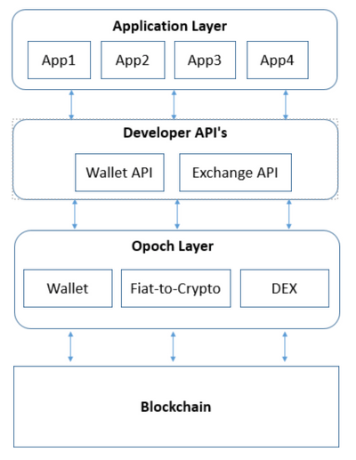

# Opoch Platform

Opoch aims to become the gateway app for all decentralized experiences, for billions of users. We are building Opoch in an open and modular manner, thus opening our platform with features and modules for empowering developers and businesses with our platform. This removes the redundancy of building common infrastructure requirements for multiple use cases.

We begin by providing Wallet and Exchange APIs for developers so that they can focus on their product/service without worrying about starting from scratch. Opoch Platform would help catapult the cryptocurrency adoption by building together with the community.

### Developer APIs

Opoch provides APIs for other developers to build on Opoch's platform.

#### Wallet API

* **Message Signing Request**: One of the most common scenarios in a decentralized application is signing a message using a user's private key for verification. Developers building over Opoch can generate a request, using our wallet APIs, to users for signing a particular message. After the request is successfully created, the user would be prompted on the Opoch Application user interface to sign the message. The signed transaction would then be returned as response to application.

* **Transaction Request:** Apart from signing request decentralized application would require transfer of crypto assets. Application building over Opoch would be able to use APIs in same way as signing message. The user would be prompted with amount and crypto asset to be transferred. The response would be sent to the application once the transaction confirmation is received from the blockchain.

#### Exchange API

* **Token Exchange Request**: Application might require tokens that user does not hold in his/her Opoch wallet. In this case, applications building over Opoch can prompt the user to exchange other tokens for required tokens. If there are insufficient assets to provide this exchange, Opoch platform will initiate buying request for required tokens through Fiat-Crypto Exchange API. Post this, the application process will be resumed for completion.

* **Subscription**: Subscription economy has been rising in recent years. There are some great examples like Netflix and Spotify of success of Opt-out subscription model. There were 11 Million business-to-consumer subscribers in US alone in 2017\[citation\]. There is no-way in current cryptocurrency ecosystem to power these businesses.  Opoch enables opt-out subscription model with crypto assets available Blockchain with smart contracts . On the user side we create a single smart contract to handle all the subscriptions. The business would be able to deduct approved amount of tokens from this smart contract in a pre-specified time window.

